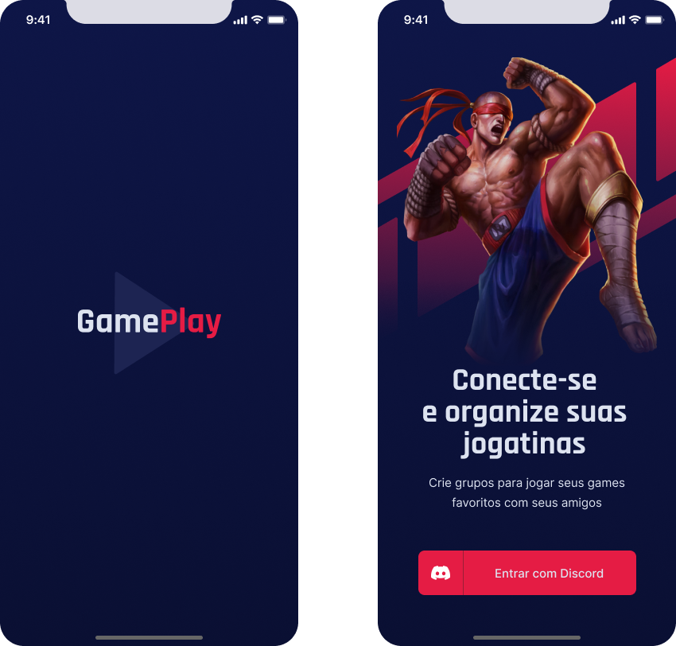

<br />
<br />
<h1 align="center">
   
  <br />
  <br />
  Expo | React Native | Discord API | Typescript
</h1>

<p align="center">
  
  
  
   <br />
</p> 
<br />
<br />

## :bookmark: Resumo
<br />

Já passou pela situação onde você e seus amigos querem jogar juntos, mas não encontram um horário onde todos
estejam disponíveis, ou até mesmo chegou a esquecer que marcou de jogar com um deles? - Então esse APP veio para
salvar suas jogatinas!

O GamePlay App veio para te salvar, o GamePlay App agenda jogatinas com seus amigos e com a integração da api do 
Discord App facilita ainda mais esse processo, o que permite tambem que os usuários possam enxergar quem esta online
e que não está e entre outras funcionalidades.

Espero que goste do projeto, o projeto foi construido pela Rocketseat na NLW-Together (um evento que consiste em uma semana de muitos códigos
e desafios para nós devs chegarmos ao próximo nível) e desenvolvido por mim, espero que gostem do projeto!

<br />

## :bulb: Conteúdos abordados
<br />

- React Native
- Expo
- Context API's
- React hooks
- Discord API
- Variáveis ambiente

<br />

## :eyes: Interface do projeto
<br />

O protótipo do projeto foi construído na plataforma FIGMA e por [@TiagoLuchtenberg](https://www.instagram.com/tiagoluchtenberg/) e ficou lindo! 
seguem algumas das telas logo abaixo:

<br />

<p align="center">
   
</p>

<br />
<br />

<p align="center">
   
</p>

<br />


## :wrench: Colocando o projeto para rodar
<br />

Para colocar o projeto para rodar, basta seguir o passo a passo fornecido logo abaixo:

- 1º: Tenha o NODE instalado na sua máquina;
- 2º: Faça o download deste projeto;
- 3º: Baixe e instale o Expo App direto no seu smartphone ou emulador. O app pode ser encontrado na Google Play ou Apple Store.
- 4º: Com o terminal/prompt abra o diretório deste projeto e execute o comando `npm run` ou `yarn`;
- 5º: Enquanto executa o comando... siga o passo-a-passo para configurar o Discord API neste [link-discord](https://github.com/EddyPBR/gameplay/tree/main/.github/discord);
- 6º: Crie um arquivo `.env` no diretório raiz do projeto;
- 6º: Copie as variaveis do arquivo `.env.example` e cole no `.env` copie as variaveis logo abaixo, agora preencha as informações com os dados obtidos no Discord API `passo 4`;

```
REDIRECT_URI=
SCOPE=
RESPONSE_TYPE=
CLIENT_ID=
CDN_IMAGE=
```

- 7º: Após finalizado o comando do `passo 3` e com tudo finalizado, execute o comando `npm run start` ou `yarn start`;
- 8º: O expo terá aberto uma nova janela no seu navegador, agora no lado esquerdo selecione a opção Tunnel;
- 9º: No seu smartphone abra o app do expo, e selecione `Scan QR Code` e faça o scan do QR Code do seu nevegador;
- 10º: Tente fazer login no APP (já lhe adianto que dará errado), porém será retornado uma mensagem do expo no seu terminal,
como mostra a figura logo abaixo;

<p align="center">
   
</p>

- 11º: Copie a URL da mensagem, vá na sua API do discord, vá na opção OAuth2, no campo `REDIRECTS` cole a URL que o expo forneceu;
- 12º: No campo OAuth2 URL Generator confirme a nova URL;
- 13º: Recarregue a aplicação e pronto, faça bom proveito do projeto!

<br />

## :memo: License

Este projeto esta sob a [MIT license](LICENSE) para mais detalhes.
<br />
<br />

## :wave: Social

Siga @EddyPBR nas redes :wink:
<br />

- [Instagram](https://www.instagram.com/edvaldo_junior_dev/)
- [LinkedIn](https://www.linkedin.com/in/edvaldojuniordev/)

<br />

Siga a @Rocketeat nas redes
<br />

- [Website](https://rocketseat.com.br/)
- [YouTube](https://www.youtube.com/channel/UCSfwM5u0Kce6Cce8_S72olg)
- [Instagram](https://www.instagram.com/rocketseat_oficial/?hl=pt-br)
